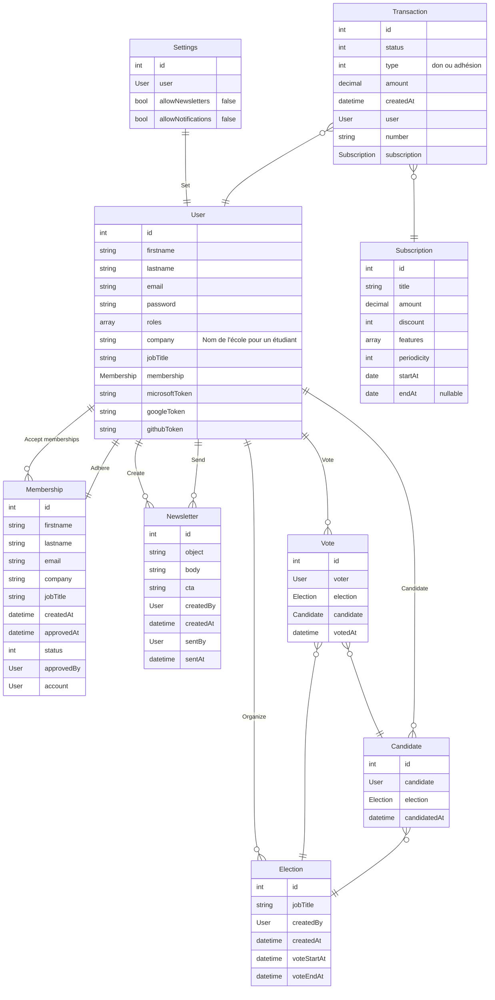

```mermaid
erDiagram
    User {
        int id
        string firstname
        string lastname
        string email
        string password
        array roles
        string company "Nom de l'école pour un étudiant"
        string jobTitle
        Membership membership
        string microsoftToken
        string googleToken
        string githubToken
    }

    Membership {
        int id
        string firstname
        string lastname
        string email
        string company
        string jobTitle
        datetime createdAt
        datetime approvedAt
        int status
        User approvedBy
        User account
    }

    Subscription {
        int id
        string title
        decimal amount
        int discount
        array features
        int periodicity
        date startAt
        date endAt "nullable"
    }

    Transaction {
        int id
        int status
        int type "don ou adhésion"
        decimal amount
        datetime createdAt
        User user
        string number
        Subscription subscription
    }

    Settings {
        int id
        User user
        bool allowNewsletters "false"
        bool allowNotifications "false"
    }

    Newsletter {
        int id
        string object
        string body
        string cta
        User createdBy
        datetime createdAt
        User sentBy
        datetime sentAt
    }

    Election {
        int id
        string jobTitle
        User createdBy
        datetime createdAt
        datetime voteStartAt
        datetime voteEndAt
    }

    Candidate {
        int id
        User candidate
        Election election
        datetime candidatedAt
    }

    Vote {
        int id
        User voter
        Election election
        Candidate candidate
        datetime votedAt
    }
    


    User 1--0+ Membership: "Accept memberships"
    User 1--1 Membership: "Adhere"
    
    Settings 1--1 User: "Set"
    
    User 1--0+ Newsletter: "Create"
    User 1--0+ Newsletter: "Send"

    User 1--0+ Election: "Organize"

    User 1--0+ Vote: "Vote"
    User 1--0+ Candidate: "Candidate"

    Vote 0+--1 Election: ""
    Vote 0+--1 Candidate: ""

    Candidate 0+--1 Election: ""

    Transaction 0+--1 User: ""
    Transaction 0+--1 Subscription: ""
```