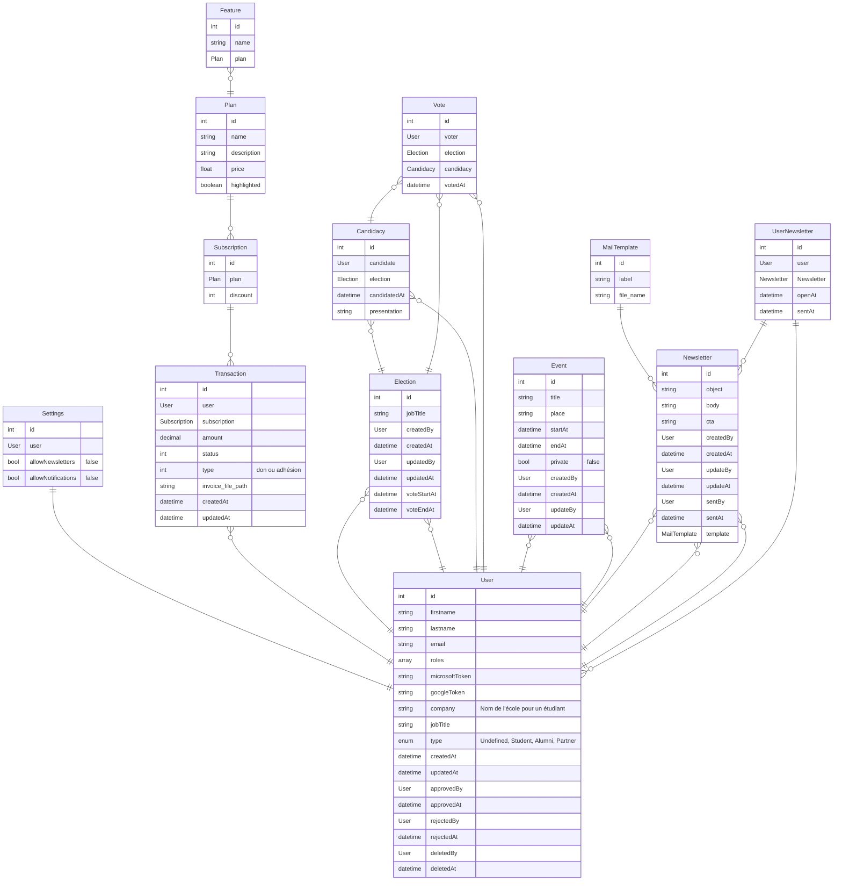

```mermaid
erDiagram
    User {
        int id
        string firstname
        string lastname
        string email
        array roles
        string microsoftToken
        string googleToken
        string company "Nom de l'école pour un étudiant"
        string jobTitle
        enum type "Undefined, Student, Alumni, Partner"
        datetime createdAt
        datetime updatedAt
        User approvedBy
        datetime approvedAt
        User rejectedBy
        datetime rejectedAt
        User deletedBy
        datetime deletedAt
    }

    Settings 1--1 User: ""

    Settings {
        int id
        User user
        bool allowNewsletters "false"
        bool allowNotifications "false"
    }

    Transaction 0+--1 User: ""

    Transaction {
        int id
        User user
        Subscription subscription
        decimal amount
        int status
        int type "don ou adhésion"
        string invoice_file_path
        datetime createdAt
        datetime updatedAt
    }

    Subscription 1--0+ Transaction: ""

    Subscription {
        int id
        Plan plan
        int discount
    }

    Plan 1--0+ Subscription: ""
    
    Plan {
        int id
        string name
        string description
        float price
        boolean highlighted
    }

    Feature 0+--1 Plan: ""

    Feature {
        int id
        string name
        Plan plan
    }

    Election 0+--1 User: ""
    Election 0+--1 User: ""

    Election {
        int id
        string jobTitle
        User createdBy
        datetime createdAt
        User updatedBy
        datetime updatedAt
        datetime voteStartAt
        datetime voteEndAt
    }

    Candidacy 0+--1 User: ""
    Candidacy 0+--1 Election: ""

    Candidacy {
        int id
        User candidate
        Election election
        datetime candidatedAt
        string presentation
    }

    Vote 0+--1 User: ""
    Vote 0+--1 Election: ""
    Vote 0+--1 Candidacy: ""

    Vote {
        int id
        User voter
        Election election
        Candidacy candidacy
        datetime votedAt
    }

    Event 0+--1 User: ""
    Event 0+--1 User: ""

    Event {
        int id
        string title
        string place
        datetime startAt
        datetime endAt
        bool private "false"
        User createdBy
        datetime createdAt
        User updateBy
        datetime updateAt
    }

    Newsletter 0+--1 User: ""
    Newsletter 0+--1 User: ""
    Newsletter 0+--1 User: ""

    Newsletter {
        int id
        string object
        string body
        string cta
        User createdBy
        datetime createdAt
        User updateBy
        datetime updateAt
        User sentBy
        datetime sentAt
        MailTemplate template
    }

    MailTemplate 1--0+ Newsletter: ""

    MailTemplate {
        int id
        string label
        string file_name
    }

    UserNewsletter 1--0+ User: ""
    UserNewsletter 1--0+ Newsletter: ""

    UserNewsletter {
        int id
        User user
        Newsletter Newsletter
        datetime openAt
        datetime sentAt
    }
```